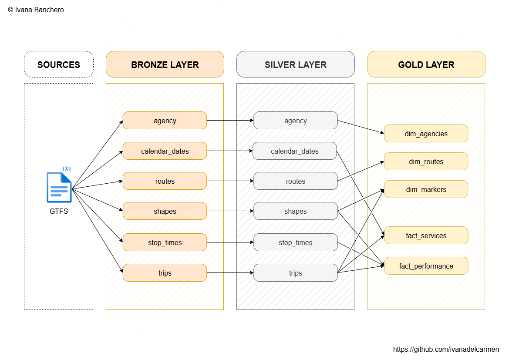
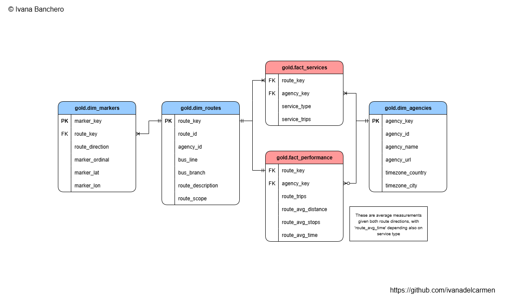

# **Data warehouse with historical bus GTFS data using SQL Server and exploratory analysis via Jupyter Notebook**

## Abstract

The following project develops a modern data warehouse using T-SQL and SQL through ETL tasks which handle hundreds of thousands of rows associated with the static GTFS (General Transit Feed Specification) data of [Buenos Aires buses](https://data.buenosaires.gob.ar/dataset/colectivos-gtfs), including agency information, stop times, service days, and many more attributes which are leveraged to enable analytical reporting with insights regarding:

* Relationship between route attributes
* Trends according to service days and bus lines
* Statistics grouped by agencies

Data is imported from one source system provided as six `.txt` files with `.csv` format, excluding `stops.txt` which will not be used. Prior to analysis, data quality issues are cleansed and resolved, and additional columns are included in order to facilitate the connection between data models and their visualization. Sufficient data normalization standards are also met.

Extensive exploratory analysis was documented in `overview.ipynb` using the `polars` Python library before scripting the data warehouse and after encountering exceptions in the process to analyze attributes of data useful for its latter manipulation and categorization. It is recommended to read this file in order to understand the nature of the dataset and the decisions made within the data warehouse.

## Architecture

The pipeline follows the Medallion architecture, loading tables in each stage schema through DDL scripts, stored procedures, and scalar functions to compute exceptional columns. The full data flow is as follows:



#

### Extraction

The pipeline completely appeals to a full extraction type. In the bronze layer, data is pulled from SQL Server using the procedure from `load_bronze.sql` and each `.txt` file is parsed into the data warehouse using specific settings for row lookup, delimiters, and also encoding since the dataset contains characters found in Spanish ortography. For the next layers, data is extracted from the previous stages through database querying.

#

### Transformation

#### SILVER

Type casting, removing unwanted characters from text values, uppercasing required fields, deriving columns, canonicalization (e.g. replacing 'ENIE' with the letter 'Ñ'), and outlier detection are the data cleansing processes performed in this silver layer, the latter being the most issued task in this stage. 

For example, anomalies in **bronze.routes** were found in the column 'route_short_name' which is planned to be separated into the columns bus_line and bus_branch. For both derived columns, adequate CASE expressions are implemented in the silver layer procedure `load_silver.sql` which cover two main cases where the values start either with letters or digits. In this column, values with letters first belong to the minority of the data, as seen running the next SQL query which filters and shows the outlier values:

```
SELECT route_short_name
FROM (
	SELECT
		route_short_name,
		CASE
			-- First, remove unnecessary double quotes
			WHEN TRIM('"' FROM route_short_name) LIKE '[A-Z]%' THEN 1
			WHEN TRIM('"' FROM route_short_name) LIKE '[0-9]%' THEN 0
		END AS flag
	FROM bronze.routes
) aux
WHERE flag = 1
```

Additionally, in **silver.calendar_dates** services are tagged with keywords in the column 'service_type', created according to each service ID in the way described as a result of the analysis in `overview.ipynb` where the following is concluded:

* Service 1 ('Saturday') is for saturdays and holiday vespers
* Service 2 ('Sunday') is for sundays
* Service 3 ('Weekday') is for weekdays
* Service 4 ('Holiday') is for holidays

#### GOLD

For the gold layer, data sourced directly from tables in the silver layer, with performance enhancements within queries or through specific indexes, is combined and joined to create gold tables and new columns following a galaxy schema with two fact tables with merely metrics —not events nor transactions— and three dimensions, two of which connect directly with both fact tables. The visualization of the data model is as follows:



> The schema was originally meant to have one fact table with measurements regarding each route and each service within each route, resulting in repeated overall route data among rows which was not dependant on service attributes. The problem arising from this prototypical model is, consequently, the violation of the Boyce-Codd normal form by containing non-prime attributes which do not depend solely on the superkey composed by not only route attributes but also service attributes.
>
> Instead, to preserve data integrity given the standard third normal form, **gold.fact_performance** contains only attributes related to overall route data, and the extrapolated table **gold.fact_services** contains the attributes dependant only on the conjunction of route key attributes —including 'agency_key'— and service key attributes.

The specific transformations for this stage include creating surrogate keys which provide a stable and stepwise identifier for each record in the dimension tables, computing the count of trips for **gold.fact_services** grouped by service and route, and computing the count of total trips per route for **gold.fact_performance** along with route average measurements. 

One different CTE is used for each non-key attribute in **gold.fact_performance**, along with two temporary tables which have individual trips grouped by:

1. Route, service, and direction
2. Route and direction

**#representative_trips_service** is implemented to get 'route_avg_time', the average of each route's completion time, since stop times vary depending on service type and direction. Therefore, for each route representative trips grouped by both attributes are tabularized and joined with **silver.stop_times**. Given the atypical display of times in the 'arrival_time' column, they are compared lexicographically to get the minimum and maximum values along the representative trips' paths and then the time differences are computed using the functions defined at `functions_gold.sql`, which must be run before `load_gold.sql`.

**#representative_trips_direction**, on the other hand, is implemented to get 'route_avg_distance' and 'route_avg_stops' since these attributes are not dependant on service type but rather on direction exclusively. Analogously, for each route representative trips grouped by direction are tabularized and joined with **silver.shapes** and **silver.stop_times** respectively.

Both temporary tables are useful for handling different operations at different scenarios, as detailed in `overview.ipynb`, and at the same time they reduce the querying performance and are reusable for one-time ETL tasks without overloading permanent storage.

#

### Loading

Since the pipeline gathers data from one static source system, loading tasks imply batch processing, parsing files from scratch for each possible update in the dataset and, in turn, the GTFS records. However, the recurrent loading method does not include historization but instead overwrites data (SCD 1) as stored procedures perform full loads by first truncating each table and subsequently inserting data. Running the DDL scripts may also be destructive since tables are dropped if they already exist within the database. 

<div style="text-align:center; font-style: italic">Run the scripts in order and thoughtfully to avoid exceptions or unwanted outputs.</div>